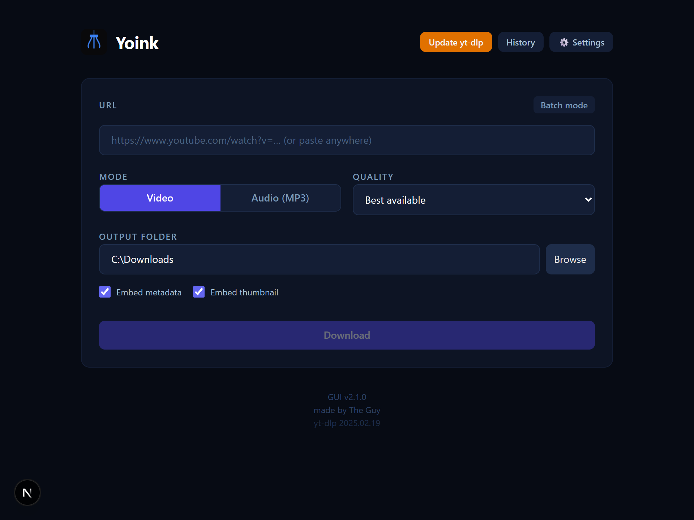
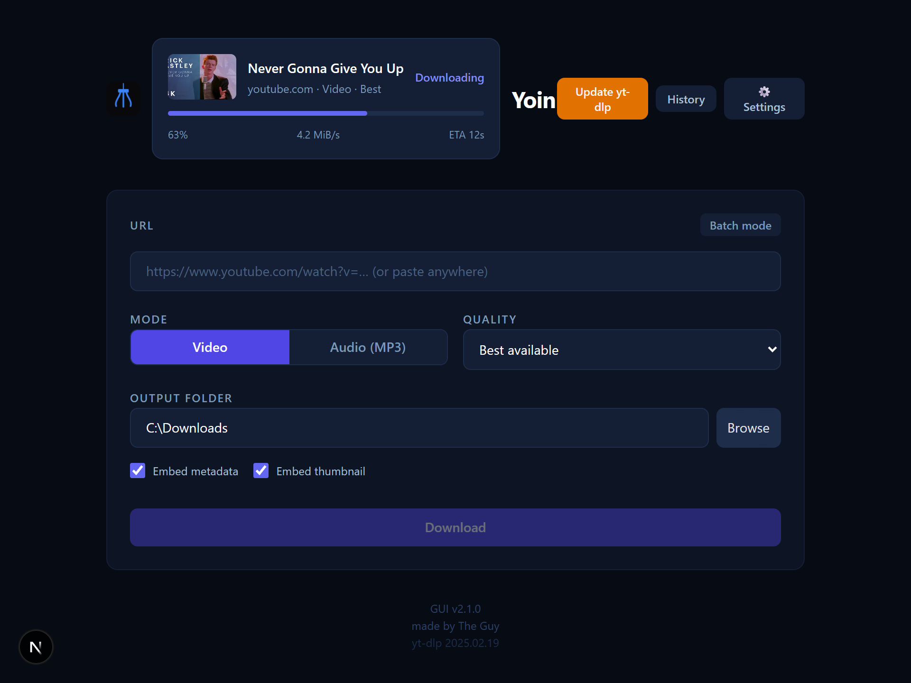
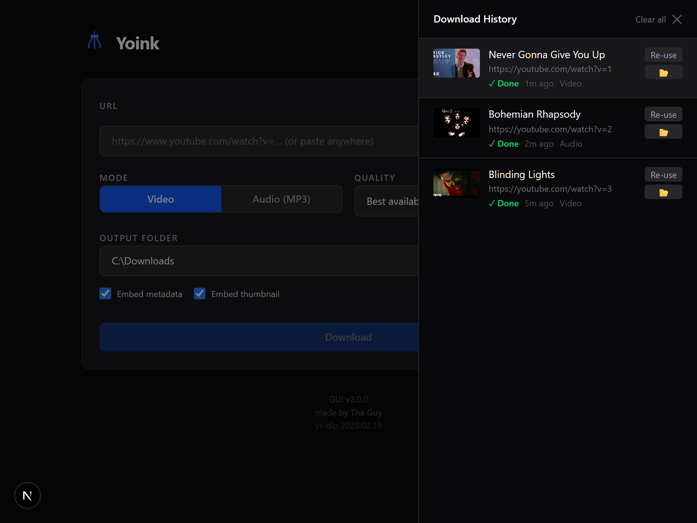
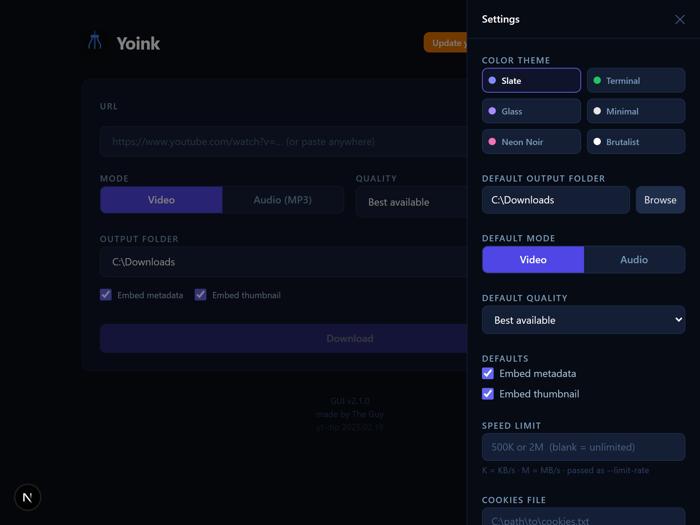
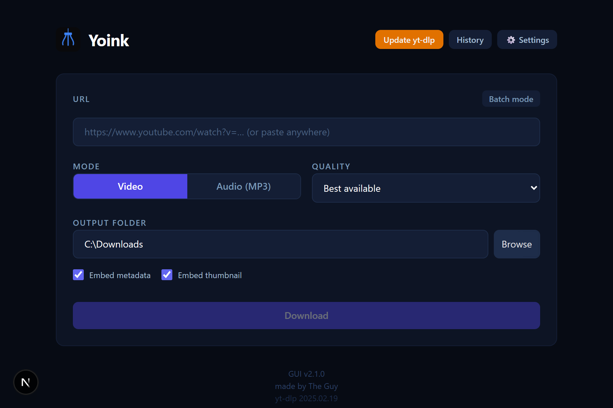
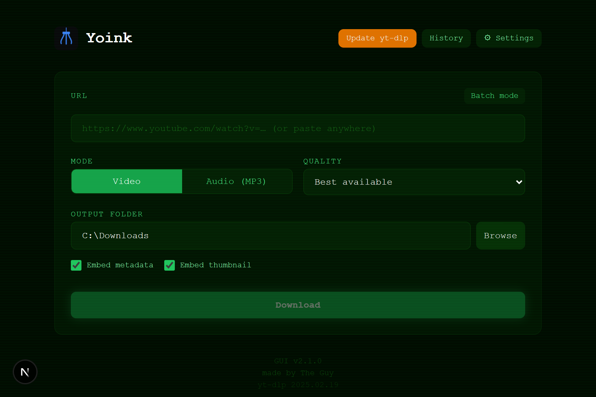
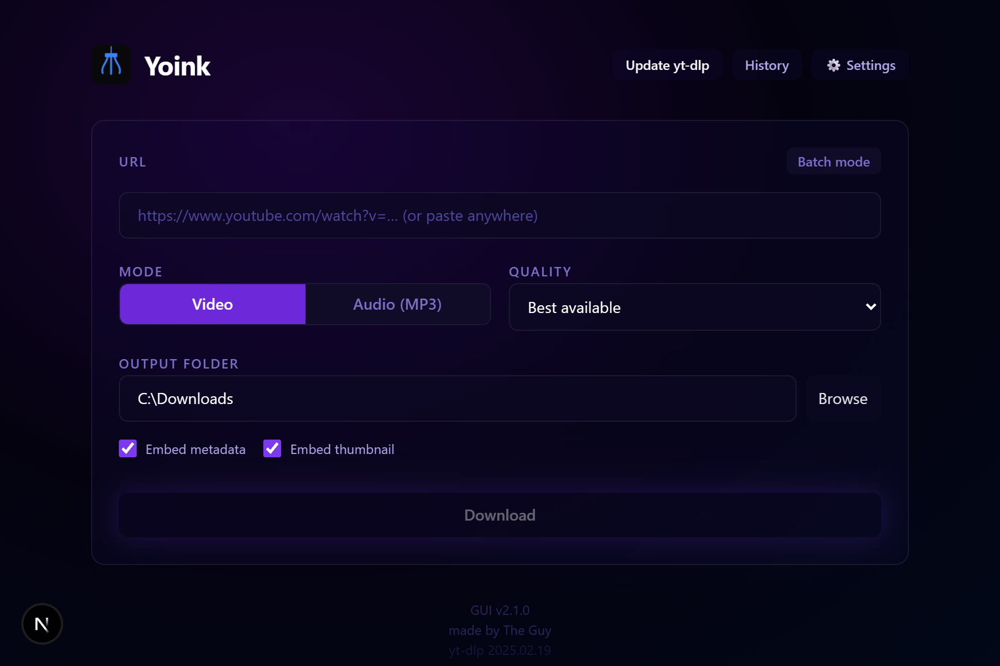
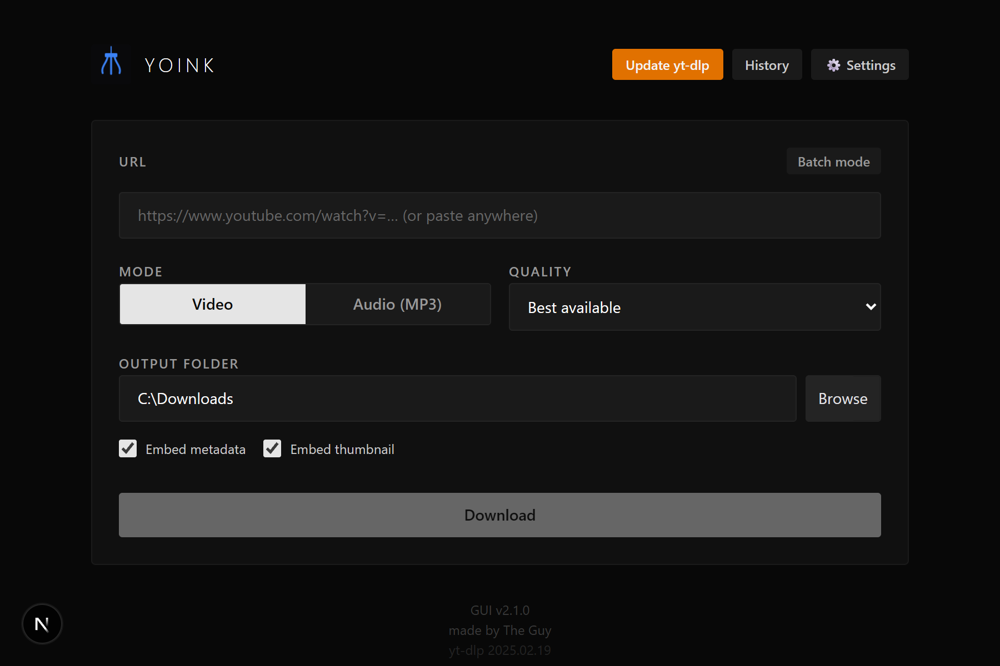
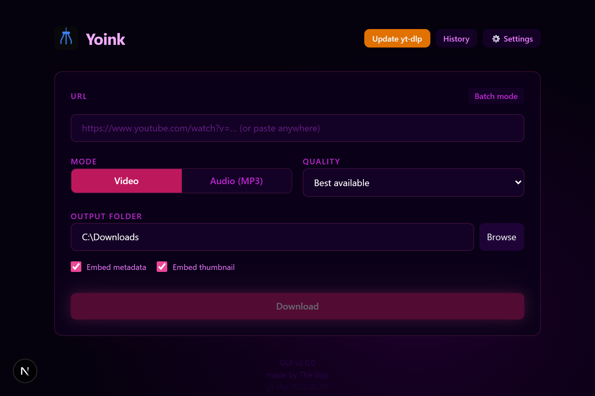
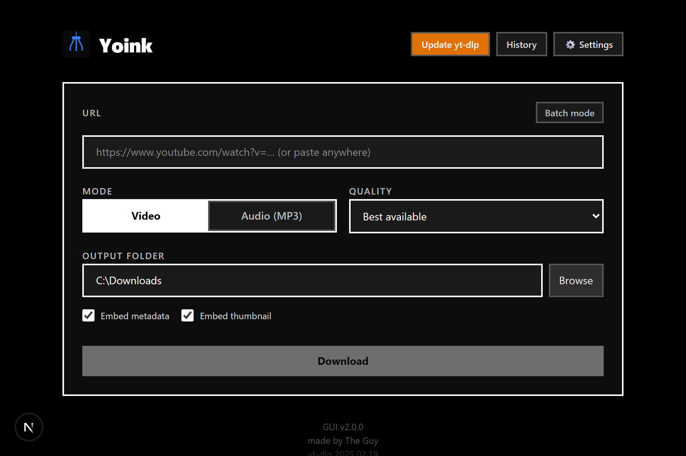

# Yoink

A clean, local desktop app (Electron) wrapping [yt-dlp](https://github.com/yt-dlp/yt-dlp) — no accounts, no cloud, just downloads.

Also includes a [**browser extension**](extension/) (Chrome / Firefox / Edge / Brave / Opera) and a [**Premiere Pro panel plugin**](premiere-plugin/), all sharing the same `%APPDATA%\Yoink\` data folder for unified history and a single shared yt-dlp binary.



---

## Features

- **Video & audio downloads** — MP4 or MP3, with quality selection (Best, 1080p, 720p, 480p, 360p)
- **Batch mode** — paste multiple URLs at once
- **Real-time progress** — live progress bar, speed, and ETA per download
- **Format picker** — inspect available formats before downloading
- **Download history** — browse past downloads with thumbnails
- **Metadata & thumbnail embedding** — toggle per download
- **Cookies support** — pass a cookies file for age-gated or private content
- **Speed limiter** — cap download speed
- **yt-dlp updater** — update yt-dlp from within the UI with a progress indicator
- **Themes** — 6 themes: Slate, Terminal, Glass, Minimal, Neon Noir, Brutalist

| Downloading | History | Settings |
|---|---|---|
|  |  |  |

### Themes

| Slate | Terminal | Glass |
|---|---|---|
|  |  |  |

| Minimal | Neon Noir | Brutalist |
|---|---|---|
|  |  |  |

---

## Requirements

**End users:** nothing. The installer bundles yt-dlp and ffmpeg, seeding them to
`%APPDATA%\Yoink\` on first launch. (If a copy already lives there — e.g. from
the browser extension or Premiere plugin — Yoink uses it instead of overwriting.)

**Building from source:**

- [Node.js](https://nodejs.org/) 18+

yt-dlp and ffmpeg are downloaded automatically at build time by
`scripts/fetch-ytdlp.mjs` and bundled into the installer — you do not need them
on your PATH.

---

## Getting Started

```bash
npm install
node scripts/fetch-ytdlp.mjs   # one-time: download yt-dlp + ffmpeg for dev
npm run dev:electron
```

`dev:electron` starts Next.js and launches the Electron shell once it's ready.
(`npm run dev` only starts the Next.js dev server with no Electron backend, so
the app's download functionality won't work — use `dev:electron`.)

**Binaries in dev:** the production installer bundles yt-dlp + ffmpeg, but
`dev:electron` does **not** fetch them. Run `node scripts/fetch-ytdlp.mjs` once
after cloning — it populates `electron/resources/`, which the app then seeds
into `%APPDATA%\Yoink\` on first launch. (Alternatively, having `yt-dlp` and
`ffmpeg` on your PATH works too — the app falls back to PATH.) `npm run
build:electron` runs this fetch automatically, so it's only a manual step for
dev mode.

---

## Installing

Download `Yoink-Setup-x.y.z.exe` from the [latest release](https://github.com/HesNotTheGuy/Yoink/releases/latest). Run the installer — it's per-user by default (no admin needed), creates a Start Menu shortcut, and shows up in Add/Remove Programs.

Companion downloads on the same release page:
- `Yoink-Extension-x.y.z.zip` — browser extension for Chrome / Firefox / Edge / Brave
- `Yoink-Premiere-Plugin-x.y.z.zip` — Adobe Premiere Pro panel

### Building from source

```bash
npm install
npm run build:electron
```

The installer is written to `dist/Yoink-Setup-x.y.z.exe`.

---

## Stack

- [Electron](https://www.electronjs.org/) — desktop shell + Node backend
- [Next.js 16](https://nextjs.org/) + [React 19](https://react.dev/) — renderer (static export)
- [Tailwind CSS v4](https://tailwindcss.com/)
- yt-dlp + ffmpeg via `child_process` — no wrappers, no abstractions

---

made by The Guy
