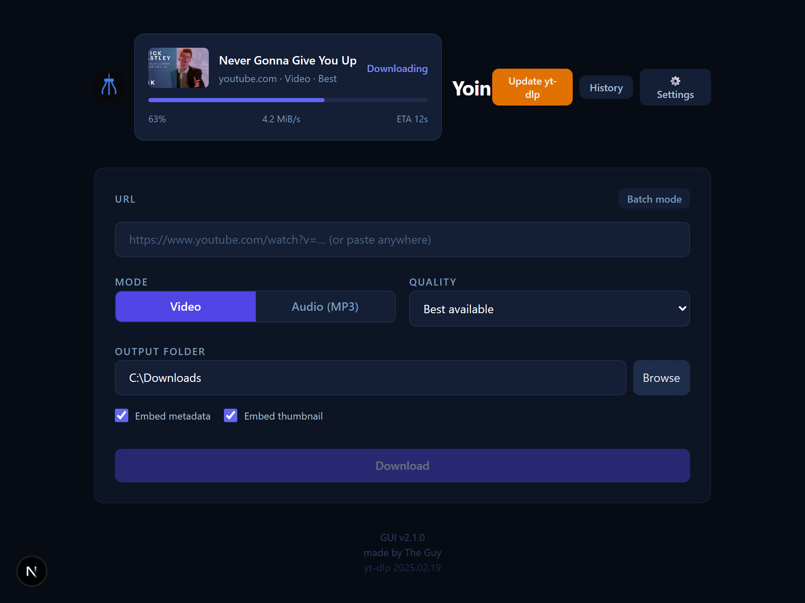

# Yoink

A local desktop GUI around [yt-dlp](https://github.com/yt-dlp/yt-dlp) for downloading from any site it supports.



## Install

Windows: grab `Yoink-Setup-*.exe` from the [latest release](https://github.com/HesNotTheGuy/Yoink/releases/latest) (per-user, no admin). yt-dlp and FFmpeg are bundled.

From source (Node.js 18+):

```bash
npm install
node scripts/fetch-ytdlp.mjs
npm run dev:electron
```

Installer build: `npm run build:electron`. More detail: [docs/from-source.md](docs/from-source.md).

## Credits

Public domain ([UNLICENSE](UNLICENSE)). Downloads run through [yt-dlp](https://github.com/yt-dlp/yt-dlp) (Unlicense) and [FFmpeg](https://ffmpeg.org) (LGPL shared build from [BtbN](https://github.com/BtbN/FFmpeg-Builds)). Full notices: [THIRD-PARTY-NOTICES.md](THIRD-PARTY-NOTICES.md).
